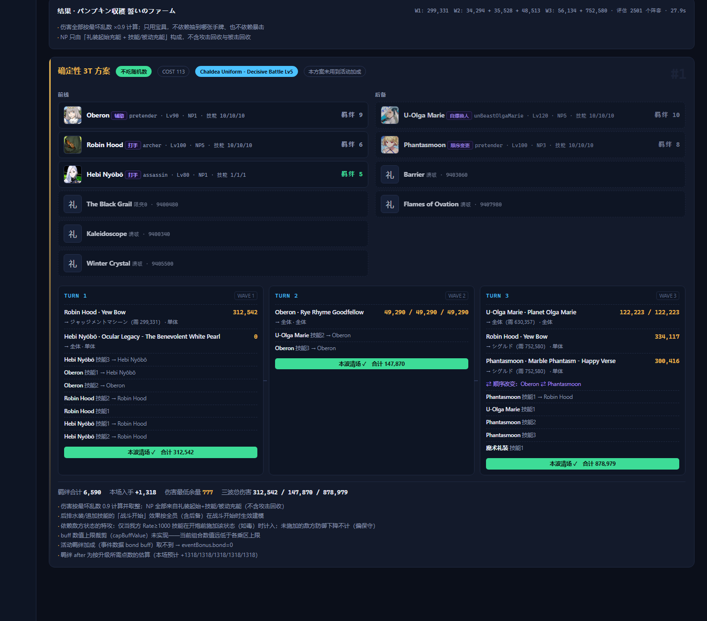
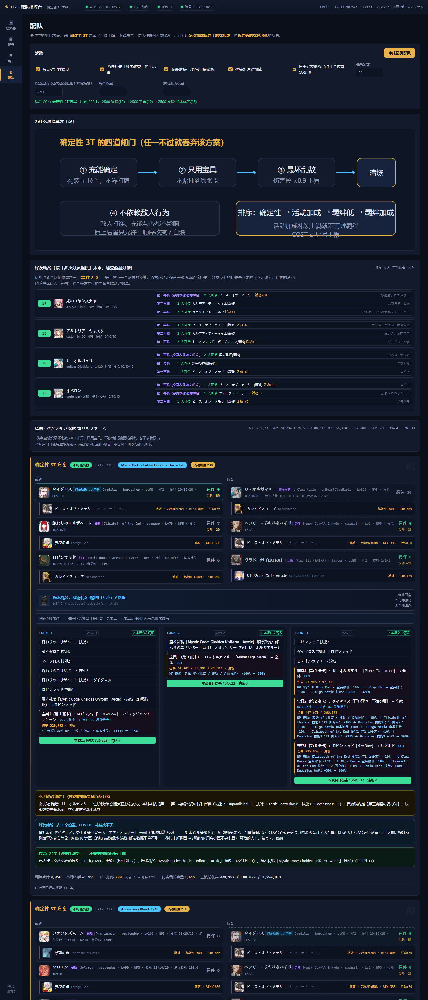
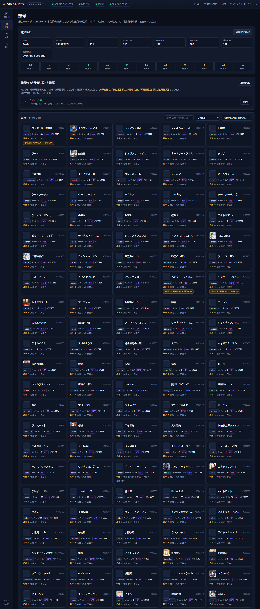

# FGO Team Lab

给 FGO 周回用的 **3T 配队生成器**：读你自己账号的真实练度，算出「**确定能 3 回合过本**」的配队，并给出**照着点就行的剧本**。

不是「大概能过」的推荐，是逐条给你：这一回合点哪个技能、给谁、宝具按什么顺序点、每一炮的 NP 是从哪来的、伤害余量还剩多少。

支持 **多开模拟器 / 多账号**：每个号抓一次存成一份「账号档」，之后一键切换，不用重抓。







## 它保证什么

- **3T 是硬门槛**：只输出「最坏情况也过」的方案，过不了就不给。
- **完全确定性**：伤害按最坏乱数 0.9 逐项取整；不吃手牌、不赌暴击；**只用宝具**；
  NP 只能来自礼装起始充能 + 技能/被动充能（不算攻击回收）。
- **每一炮的 NP 来源写清楚**：起始（礼装/被动/追加技能）+ 每一次充能 = 合计百分比。够不够可以自己核对。
- **形态要求会显著提醒**：技能随灵基再临变化的从者，会告诉你必须摆哪个形态，否则整套不成立。

## 它怎么帮你多贪

「刚刚好够 3T」的前提下，按这个优先级贪：

1. **活动加成**（最高优先）
2. **礼装效用**：羁绊 / QP / 御主EXP / 魔术礼装EXP / 友情点
3. **羁绊**：优先把羁绊等级低的从者带上（练度不浪费）

具体做的事包括：把伤害余量换成本活动加成从者、伤害够了就把伤害礼装换成羁绊礼装、
处理**有条件的羁绊礼装**（比如「〔悪〕或〔星の属性〕的絆 +20%」——队里满足条件的人越多收益越高）、
避免把**絆礼装**（只对特定从者生效）发错人、借好友助战（COST 0，白拿一份加成）等等。

## 下载与运行

1. 到 [**Releases**](../../releases) 下载最新的 `fgo-team-lab-<版本>.zip`
2. 解压到任意目录（**整个文件夹一起解压**，路径别带特殊符号）
3. 双击 **`启动.bat`** → 浏览器自动打开 `http://127.0.0.1:8787/`
4. 第一次用按 [使用说明.md](使用说明.md) 走一遍：抓一次账号 → 拉关卡 → 生成配队（约 5 分钟）

## 环境要求

- **Windows 10 / 11**
- **MuMu 模拟器 12**（网易 MuMu），里面装好 FGO；建议开启 root
- 能联网（首次拉取从者数据、读取好友助战）
- 不需要装 Node.js（包里自带运行时）

## 目录结构

```
启动.bat            双击启动
node/               内置 Node 运行时
server/             本地服务（含抓包代理）
tools/              数据拉取脚本（关卡/从者详情/助战候选）
app/  index.html    界面
使用说明.md          第一次用看这个
使用条款.md          使用范围与免责
screenshots/        截图
```

运行时会在本地生成这些目录（都只存在你自己电脑上）：

```
account/            账号快照、好友列表；account/profiles/<账号id>/ = 每个号一份账号档
cache/              抓包记录、关卡包、本地抓包证书
data/               从 Atlas Academy 拉来的从者/礼装数据（按当前激活的账号档）
```

## 常见问题

见 [使用说明.md](使用说明.md) 末尾的「常见问题」。

## 更新记录

- **v0.1.1**：支持多开模拟器 / 多账号（每个号一份账号档，一键切换，不用重抓）；
  修「切换账号后引擎仍用上一个号数据」；抓账号后自动拉取从者详情；
  「好友助战」加了「生成助战候选」按钮（不用再手跑脚本）；剧本里显示每炮的 NP 来源与追加技能。
- **v0.1.0**：首个公开版。

## 反馈

有 bug 或者想要的功能，欢迎在这个仓库开 Issue。反馈时请附上：

- 哪个关卡（eventId + 关卡名）
- 你看到的剧本截图（尤其**每炮的 NP 来源**那几行）
- 你判断有问题的地方（比如「这一炮按游戏里的数值 NP 不够」）

## 免责声明

- 个人开发、免费提供、**与游戏运营方无关**，不是官方工具。
- 工具只**读取**你自己账号的接口数据并在本地计算，**不会自动打本、不会替你操作战斗**。
- 但它需要通过代理读取游戏接口流量，这**属于游戏条款的灰色地带**，请自行判断是否使用，**风险自负**。
- 本仓库**不提供源代码**，详见 [使用条款.md](使用条款.md)。
